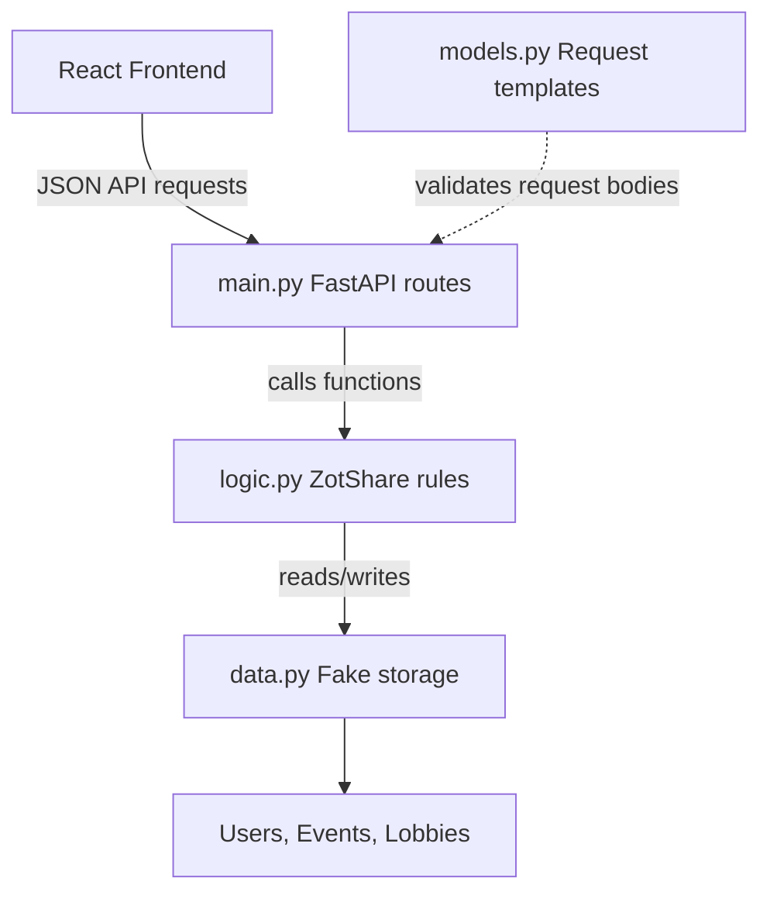

# AGENTS.md — ZotShare Simple MVP Instructions for Codex

## Project Summary

ZotShare is a beginner-friendly MVP for coordinating shared rides after UCI events.

The MVP should show this simple happy-path flow:

1. User logs in with a UCI email.
2. User verifies an event code.
3. Host creates a ride lobby.
4. Riders join the lobby.
5. Riders deposit mock USDC/demo credits.
6. Host locks the lobby.
7. Riders confirm the ride happened.
8. Funds are released from fake escrow to the host.

This is a **demo MVP**, not a production system.

The goal is to build something simple, understandable, and working.

Do **not** overbuild.

---

## MVP Philosophy

Prioritize simplicity over completeness.

The app should be easy for a beginner to understand and modify.

Use:

- simple functions
- simple dictionaries/lists
- clear names
- clear comments
- happy-path logic
- minimal files
- minimal dependencies

Avoid:

- complex architecture
- excessive error handling
- real database integration
- real OAuth verification
- real blockchain/smart contract integration
- real payment processing
- advanced auth/session handling
- premature abstractions
- unnecessary classes
- clever code

When unsure, choose the simpler implementation.

---

## Current Tech Stack

Backend:

- Python
- FastAPI
- Pydantic
- Uvicorn
- fake in-memory storage

Frontend:

- React with Vite
- simple forms and buttons
- fetch calls to FastAPI backend

Not included yet:

- Supabase
- PostgreSQL
- real Google OAuth token verification
- real wallets
- real USDC
- real blockchain
- Uber/Lyft APIs
- real payment processing

---

## Folder Structure

Use this structure:

```text
zotshare/
├── backend/
│   ├── main.py
│   ├── models.py
│   ├── logic.py
│   ├── data.py
│   └── requirements.txt
│
└── frontend/
    ├── package.json
    ├── index.html
    └── src/
        ├── App.jsx
        ├── api.js
        ├── components/
        └── styles.css
```

Keep the structure simple.

Do not add extra folders unless clearly needed.

---

## Backend Architecture

Simple MVP backend flow:



One-line meaning:

```text
React sends requests → main.py receives them → models.py defines request shapes → logic.py does the work → data.py stores fake data
```

---

# Backend Instructions

## backend/main.py

### Purpose

`main.py` is the FastAPI route layer.

It receives requests from the React frontend and calls functions from `logic.py`.

Think of it as the backend front desk.

### Keep it simple

Routes should be short.

Good:

```python
@app.post("/auth/login")
def login(request: LoginRequest):
    user = login_user(request.name, request.email)
    if user is None:
        raise HTTPException(status_code=403, detail="Only UCI emails are allowed")
    return user
```

Bad:

```python
@app.post("/auth/login")
def login(request: LoginRequest):
    # 80 lines of login, storage, validation, escrow, and business logic here
```

### Codex rules for main.py

Do:

- create the FastAPI app
- define API routes
- import request models from `models.py`
- import business functions from `logic.py`
- return simple JSON responses
- keep route functions short

Do not:

- store data here
- write complex business rules here
- add database clients here
- add blockchain code here
- add complex auth/session code here
- add frontend code here

### MVP routes

Preserve or implement these routes:

```text
GET  /
POST /auth/login
POST /events/verify
POST /lobbies
GET  /lobbies
POST /lobbies/{lobby_id}/join
POST /lobbies/{lobby_id}/deposit
POST /lobbies/{lobby_id}/lock
POST /lobbies/{lobby_id}/confirm
POST /lobbies/{lobby_id}/release
```

Minimal error handling is okay for:

- non-`@uci.edu` email
- missing object causing `None`
- obvious happy-path failure

Do not add complex error handling yet.

---

## backend/models.py

### Purpose

`models.py` defines request shapes.

Think of it as the blank form template for each backend request.

Example:

```python
class LoginRequest(BaseModel):
    name: str
    email: str
```

This means `/auth/login` expects:

```json
{
  "name": "Harini",
  "email": "harini@uci.edu"
}
```

### Codex rules for models.py

Do:

- use Pydantic `BaseModel`
- keep models small
- use snake_case field names
- define only request models for now
- use simple types like `str`, `int`, `float`, `bool`

Do not:

- store data here
- write business logic here
- call functions from `logic.py`
- import `data.py`
- add complex validators unless explicitly requested

### Required MVP models

Use these request models:

```python
from pydantic import BaseModel


class LoginRequest(BaseModel):
    name: str
    email: str


class VerifyEventRequest(BaseModel):
    event_code: str


class CreateLobbyRequest(BaseModel):
    host_email: str
    pickup_location: str
    destination: str
    departure_time: str
    max_riders: int
    deposit_amount: int


class JoinLobbyRequest(BaseModel):
    rider_email: str


class DepositRequest(BaseModel):
    rider_email: str


class ConfirmCompletionRequest(BaseModel):
    rider_email: str


class HostActionRequest(BaseModel):
    host_email: str
```

Do not switch to camelCase unless explicitly requested.

---

## backend/logic.py

### Purpose

`logic.py` is the brain of the app.

It contains the actual ZotShare rules.

Think of it as the kitchen.

### Codex rules for logic.py

Do:

- put core product logic here
- import fake storage from `data.py`
- use simple dictionaries/lists
- keep functions beginner-friendly
- keep the happy path working
- return updated users/lobbies where helpful

Do not:

- define FastAPI routes here
- define Pydantic models here
- add React/frontend code here
- add real database code here
- add real OAuth verification here
- add real blockchain code here
- add complex classes unless explicitly requested

### Required MVP functions

Implement or preserve:

```python
def login_user(name: str, email: str):
    ...

def verify_event_code(event_code: str):
    ...

def create_lobby(host_email: str, pickup_location: str, destination: str, departure_time: str, max_riders: int, deposit_amount: int):
    ...

def get_lobbies():
    ...

def join_lobby(lobby_id: int, rider_email: str):
    ...

def deposit(lobby_id: int, rider_email: str):
    ...

def lock_lobby(lobby_id: int, host_email: str):
    ...

def confirm_completion(lobby_id: int, rider_email: str):
    ...

def release_funds(lobby_id: int, host_email: str):
    ...
```

### MVP business rules

Use only these simple rules for now:

#### Login

- Only allow emails ending in `@uci.edu`.
- Create user if they do not exist.
- Reuse user if they already exist.
- New users start with `50` mock USDC/demo credits.
- Create fake wallet address like `fake_wallet_1`.

#### Event verification

- Use hardcoded event data from `data.py`.
- Demo event code: `VENUS2026`.

#### Lobby creation

- Host creates the lobby.
- Lobby starts with status `OPEN`.
- Host is added to members.
- Host does not deposit.
- `max_riders` means number of riders, not including host.

#### Join lobby

- Add rider to lobby members.
- Rider member fields:
  - `email`
  - `role = "RIDER"`
  - `payment_status = "NOT_PAID"`
  - `confirmation_status = "PENDING"`

#### Deposit

- Subtract `deposit_amount` from rider balance.
- Add `deposit_amount` to lobby escrow.
- Set rider payment status to `PAID`.

#### Lock

- Set lobby status to `LOCKED`.

#### Confirm

- Set rider confirmation status to `CONFIRMED`.

#### Release

- Add escrow balance to host balance.
- Set escrow balance to `0`.
- Set paid rider statuses to `RELEASED`.
- Set lobby status to `COMPLETED`.

### Important product note

Mock USDC/demo credits are fake.

They only demonstrate the escrow idea:

```text
rider deposits → escrow holds → ride completes → host receives
```

They are not real money.

Do not build real money support in this MVP.

---

## backend/data.py

### Purpose

`data.py` is the fake database.

Think of it as a temporary notebook.

### Codex rules for data.py

Do:

- keep simple Python lists
- store seed demo event data
- store users and lobbies in memory

Do not:

- add database clients
- add Supabase
- add file persistence
- add business logic functions
- add FastAPI routes
- add blockchain code

### Required contents

```python
users = []

events = [
    {
        "id": 1,
        "name": "VenusHacks Demo Night",
        "event_code": "VENUS2026",
        "location": "UCI",
    }
]

lobbies = []
```

### Important

This data resets when the server restarts.

That is acceptable for the MVP.

---

## backend/requirements.txt

### Purpose

Lists backend dependencies.

### Required contents

```txt
fastapi
uvicorn
pydantic
```

Do not add new dependencies unless they are actually used.

### Commands

From `backend/`:

```bash
pip install -r requirements.txt
uvicorn main:app --reload
```

Test at:

```text
http://127.0.0.1:8000/docs
```

---

# Frontend Instructions

## Frontend goal

Build a simple React UI that proves the happy path.

The frontend does not need to be perfect.

It should let the user:

1. Log in with name/email.
2. Verify event code.
3. Create a lobby.
4. View lobbies.
5. Join a lobby.
6. Deposit mock credits.
7. Lock lobby.
8. Confirm ride.
9. Release funds.

## frontend/src/api.js

### Purpose

`api.js` contains helper functions for calling the FastAPI backend.

Think of it as the frontend’s API helper file.

### Codex rules

Do:

- keep all `fetch` calls here
- use simple async functions
- use `http://127.0.0.1:8000` as the base URL for local MVP
- return JSON

Do not:

- put UI code here
- put complex state logic here
- add auth token handling unless explicitly requested

Example style:

```javascript
const API_BASE = "http://127.0.0.1:8000";

export async function loginUser(name, email) {
  const response = await fetch(`${API_BASE}/auth/login`, {
    method: "POST",
    headers: {
      "Content-Type": "application/json",
    },
    body: JSON.stringify({ name, email }),
  });

  return response.json();
}
```

---

## frontend/src/App.jsx

### Purpose

`App.jsx` is the main React screen for the MVP.

Keep it simple.

### Codex rules

Do:

- use `useState`
- show simple forms/buttons
- call functions from `api.js`
- display current user and lobbies
- keep the happy path working

Do not:

- add complex routing yet
- add global state libraries
- add authentication libraries
- add complex UI frameworks unless requested
- add overcomplicated component structure

### MVP screens can be simple sections

Use sections instead of full routing:

```text
Login section
Event code section
Create lobby section
Lobby list section
Lobby actions section
```

---

## frontend/src/components/

### Purpose

Optional simple reusable UI pieces.

Good beginner components:

```text
Header.jsx
LoginForm.jsx
CreateLobbyForm.jsx
LobbyCard.jsx
```

Do not create too many components.

If the component split becomes confusing, keep code in `App.jsx`.

---

## frontend/src/styles.css

### Purpose

Basic styling only.

Use simple CSS.

Do not spend too much time on polish until the happy path works.

---

# Testing Instructions

## Backend testing without frontend

Run backend:

```bash
cd backend
pip install -r requirements.txt
uvicorn main:app --reload
```

Open:

```text
http://127.0.0.1:8000/docs
```

Test this happy path:

1. `POST /auth/login`
2. `POST /events/verify`
3. `POST /lobbies`
4. `POST /auth/login` for riders
5. `POST /lobbies/{id}/join`
6. `POST /lobbies/{id}/deposit`
7. `POST /lobbies/{id}/lock`
8. `POST /lobbies/{id}/confirm`
9. `POST /lobbies/{id}/release`
10. `GET /lobbies`

## Frontend testing

Run frontend:

```bash
cd frontend
npm install
npm run dev
```

Use browser to test:

```text
login → verify event → create lobby → riders join → deposit → lock → confirm → release
```

---

# What Not To Build Yet

Do not build these unless explicitly requested:

```text
real Supabase database
real OAuth token verification
real blockchain
real smart contract
real USDC
real Uber/Lyft integration
real map routing
advanced route matching
dispute arbitration
complex cancellation penalties
production security
multi-page routing
deployment pipeline
complex testing framework
```

The MVP is successful when the happy path works.

---

# Definition of Done for Simple MVP

The MVP is done when:

- backend starts successfully
- `/docs` works
- UCI login works
- event code verification works
- host can create a lobby
- riders can join
- riders can deposit mock credits
- host can lock lobby
- riders can confirm
- host can release funds
- React frontend can perform the same happy path with buttons/forms

Nothing else is required for MVP.
